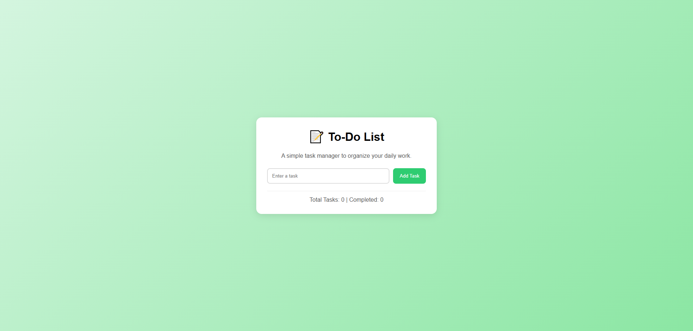
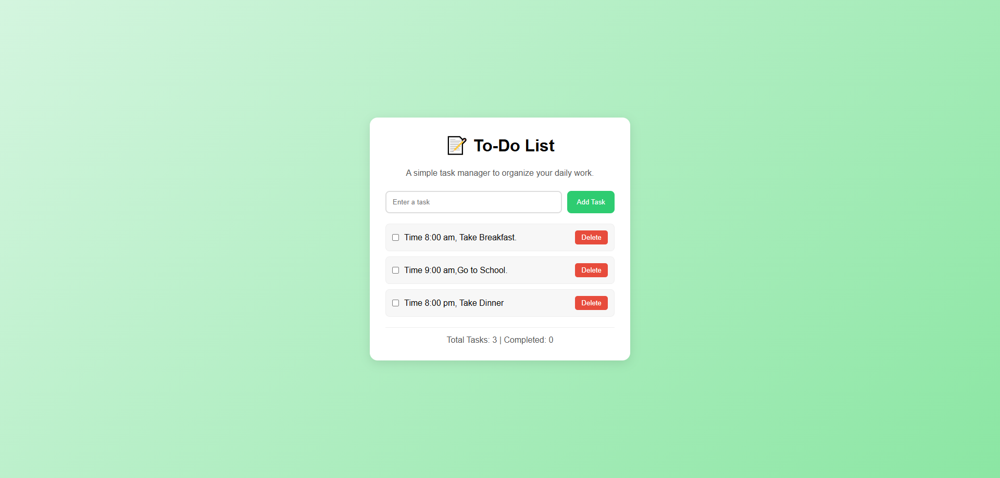
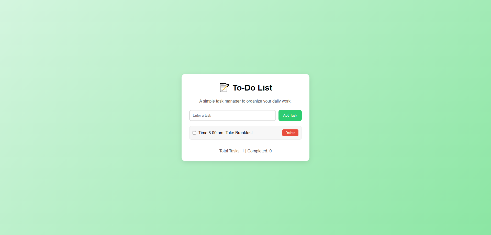

# 📝 TO-DO List

A clean and minimal To-Do List web application built with HTML, CSS, and JavaScript.

---

## 🚀 Features

- Add new tasks
- Delete tasks
- Responsive and clean UI
- Beginner-friendly JavaScript project
- Simple task management system

---

## 📂 Project Structure

```bash
TO-DO-List/
│
├── index.html
├── style.css
├── app.js
├── screenshot.png
├── screenshot2.png
├── screenshot3.png
├── screenshot4.png
└── README.md
```

---

## 🛠️ Technologies Used

- HTML5
- CSS3
- JavaScript

---

## 📸 Screenshots

### Main Interface


### Adding Task


### Task List


### Delete Feature


---

## ▶️ How to Run the Project

1. Download or clone the repository

```bash
git clone https://github.com/shahidchowdhurydev/TO-DO-List.git
```

2. Open the project folder

3. Double-click `index.html`

OR

Open with VS Code and run using **Live Server**

---

## 🔗 GitHub Repository

Repository Link:
https://github.com/shahidchowdhurydev/TO-DO-List

GitHub Profile:
https://github.com/shahidchowdhurydev

---

## 👨‍💻 Author

**Md. Shahid Chowdhury**
